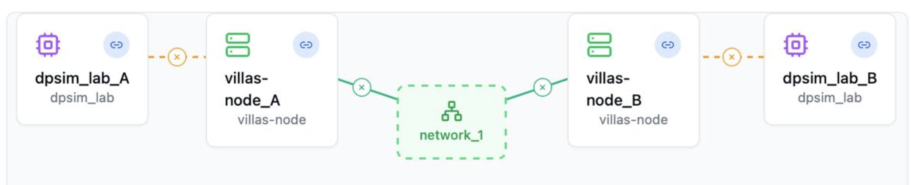

# dpsim-arm64-dev
DPSim development environment on Jupyter Lab for arm64

To start the Jupyter Lab environment, run:

```sh
docker run -v ./:/dpsim/jupyterlab -p 8888:8888 -it antoniopicone/dpsim-arm64-dev
```

or, if you have time, build from source with the Dockerfile provided:
```bash
docker build -t dpsim-arm64-dev .

# and, once image is ready:
docker run -v ./:/dpsim/jupyterlab -p 8888:8888 -it dpsim-arm64-dev
```

## DPSim and VILLASNode Simulation

 To start simulation with DPSim and VILLASNode:

```bash
git clone https://github.com/antoniopicone/dpsim-arm64-dev.git

cd dpsim-arm64-dev

docker build -t antoniopicone/dpsim-arm64-dev:1.0.3 .

cd APIsOrchestrator

docker build -t giovannibarbato/apiorchestrator-arm64-dev:1.0.0 .

cd ../Villas/test_with_docker_compose

docker compose up
```
